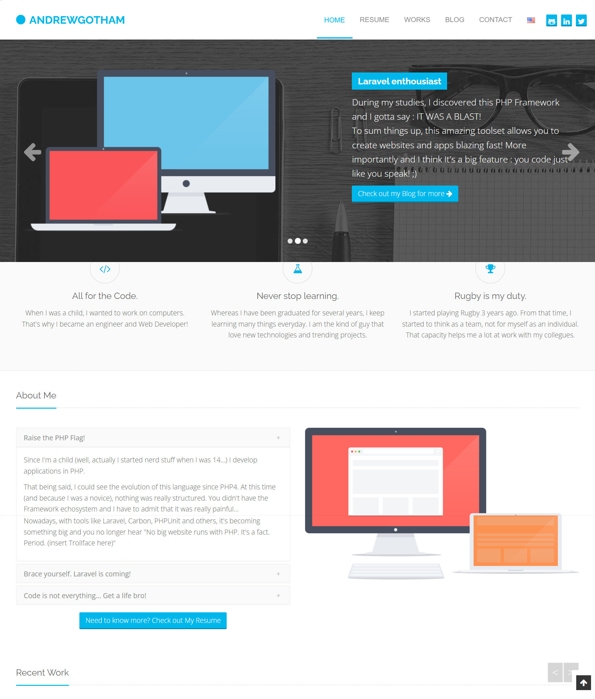
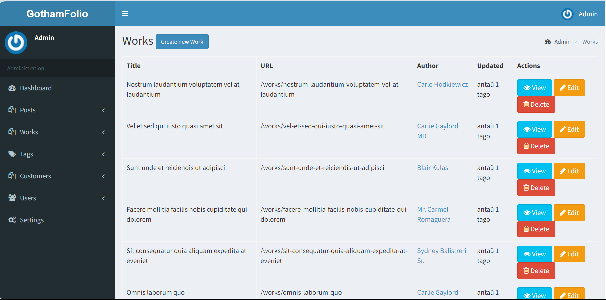

## GothamFolio

Life changes from time to time. I've come to a next turn achieving natural limits in my current position and company.

Doing same things day after day with no or very little progress or creativity does not sound right for me.

Here comes the need for a personal portfolio Web site to display the skills, knowledge and expertise I am about to bring with me to a new employee.

**GothamFolio** is a personal portfolio Web site reflecting skills and portfolios.

The site is being built with the current version of Laravel (11, and then 12 at the time of start) and Blade with some of Alipnejs at the front-end.

**GothamFolio** is about to include:

- Intro home page with download CV/resume as a Pdf file;
- Skills/Technologies;
- Work experience (works portfolio);
- Education;
- Contacts.

It will also include - as a second priority - photo galleries, as I am not seeking any placement as a photographer, but would like to include my photography works together with my photography Web sites present in the portfolio.

I am not sure about Blog section for this specific type of site, so it goes as a third-row priority together with comments system.

As a side note, GothamFolios will be multilingual enabling i18n and l13n if needed (turned off if only one language checked in the Admin backend section).

Most likely, **GothamFolio** will acquire taggable and translatable mechanisms.

Also, it will use frontend theming mechanism with a default front-end theme available and allowing to work on other designs while site is fully working and functional.

These are the plans, feel free to comment or contact me with your questions, suggestions and proposals.

Here is how it looks like with the **Legacy** theme throughout (to be changable eventually via admin interface):

## Frontend

## Backend

Sincerely,
Andrew

[Telegram contact](https://t.me/sirandrewgotham)

[Telegram web development group (in Esperanto)](https://t.me/RetejoEsperanta)

